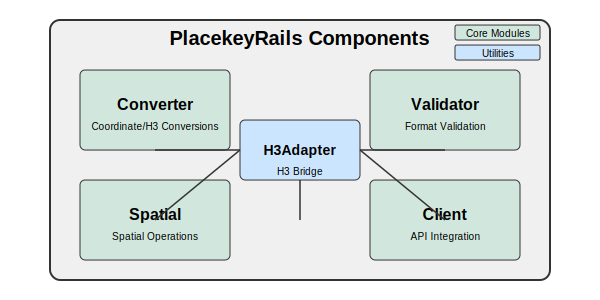

# PlacekeyRails Architecture

This document provides an overview of the PlacekeyRails engine architecture, explaining the different components and how they interact.

## Overview

PlacekeyRails is designed as a Ruby on Rails engine that provides functionality for working with Placekeys. It follows a modular architecture with clearly defined responsibilities for each component.

## Core Components

### Converter Module

The `PlacekeyRails::Converter` module is responsible for converting between different formats:

- Converts geographic coordinates (latitude, longitude) to Placekeys
- Converts Placekeys to geographic coordinates
- Converts H3 indices to Placekeys
- Converts Placekeys to H3 indices
- Handles the encoding and decoding of Placekey strings

This module is the primary entry point for basic conversion operations and relies on the H3Adapter for interfacing with the H3 library.

### Validator Module

The `PlacekeyRails::Validator` module is responsible for validating Placekey formats:

- Checks if a Placekey follows the correct format
- Validates both the "what" and "where" parts of a Placekey
- Ensures that the H3 index represented by a Placekey is valid

This module is used to ensure that Placekeys meet the required format before performing operations with them.

### Spatial Module

The `PlacekeyRails::Spatial` module handles spatial operations related to Placekeys:

- Calculates distances between Placekeys
- Finds neighboring Placekeys
- Converts Placekeys to hexagon boundaries
- Provides utilities for working with polygons, GeoJSON, and WKT
- Finds Placekeys within geographic areas

This module integrates with RGeo for advanced spatial operations and uses the H3Adapter for H3-specific functionality.

### Client Module

The `PlacekeyRails::Client` class provides an interface to the Placekey API:

- Manages authentication with the API
- Handles rate limiting and retries
- Provides methods for looking up Placekeys for addresses and coordinates
- Supports batch processing of multiple locations
- Integrates with DataFrames for data analysis

This module uses HTTParty for API communication and includes robust error handling for API interactions.

## Utilities

### H3Adapter Module

The `PlacekeyRails::H3Adapter` module serves as a bridge between the H3 gem and the PlacekeyRails functionality:

- Abstracts away direct H3 library calls
- Provides consistent interfaces for H3 operations
- Handles conversions between different H3 representations
- Manages coordinate system translations

This module is used internally by the other components and generally shouldn't need to be used directly by application code.

## Configuration

PlacekeyRails uses a simple configuration approach:

- Constants are defined in a separate module for easy reference
- API clients can be configured globally or instantiated individually
- Rate limiting can be customized based on application needs

## Integration Points

### Rails Integration

As a Rails engine, PlacekeyRails integrates with Rails applications through:

- The engine initializer
- Models (via concerns or direct usage)
- Controllers and views (through helpers)
- Background jobs (for API operations)

### External Libraries

PlacekeyRails integrates with several external libraries:

- **H3**: For hexagonal hierarchical geospatial indexing
- **RGeo**: For spatial data types and operations
- **RGeo-GeoJSON**: For GeoJSON support
- **HTTParty**: For API communication
- **Rover-DF**: For DataFrame operations similar to pandas in Python

## Design Patterns

PlacekeyRails employs several design patterns:

1. **Module Pattern**: Core functionality is organized into modules with clear responsibilities
2. **Adapter Pattern**: The H3Adapter abstracts away the details of the H3 library
3. **Facade Pattern**: The main PlacekeyRails module provides a simplified interface to the underlying components
4. **Strategy Pattern**: Different approaches for lookups (coordinates vs. addresses) are encapsulated
5. **Builder Pattern**: Complex objects like polygons and GeoJSON are constructed step by step

## Error Handling

PlacekeyRails includes comprehensive error handling:

- Custom error classes for different types of errors
- Robust handling of H3 errors
- API error handling with retries and backoff
- Validation to prevent invalid operations

## Performance Considerations

The architecture takes into account several performance considerations:

- Batch processing for API operations
- Caching opportunities for repeated lookups
- Memory management for large datasets
- Rate limiting to comply with API restrictions
